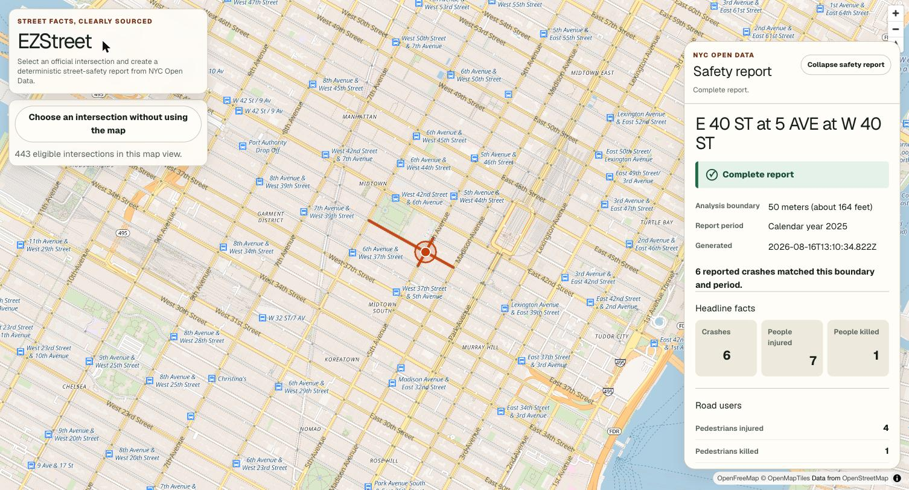
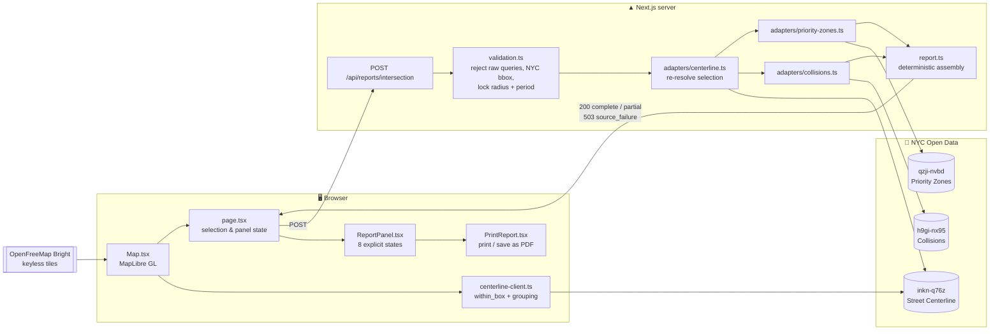

# EZStreet

**Street facts, clearly sourced.** Select an official NYC street intersection and get a deterministic, fully sourced street-safety report built from NYC Open Data.

[](https://github.com/hirekarl/ezstreet/actions/workflows/ci.yml) [](https://codecov.io/gh/hirekarl/ezstreet) [](./LICENSE) [](https://nextjs.org/) [](https://www.typescriptlang.org/) [](https://ezstreet.vercel.app)

Built for the **Built for NYC: AI Hackathon**, presented by The New York Public Library (NYPL) and Major League Hacking (MLH), August 15–16, 2026, at the Stavros Niarchos Foundation Library.

## For judges — start here

|  |  |
| --- | --- |
| ▶️ **Live demo** | **<https://ezstreet.vercel.app>** — no signup, no API key, works immediately |
| 🏆 **Devpost entry** | [on.nypl.org/hack-dev](https://on.nypl.org/hack-dev) |
| 🎯 **The challenge we picked** | [Access to city safety information](#the-challenge-we-picked) |
| 💡 **What makes it different** | [Deterministic, not generative](#what-makes-it-different) |
| 📊 **NYC Open Data usage** | [Three datasets, three roles](#nyc-open-data-usage) — our Best Use of NYC Open Data entry |
| 🤖 **AI usage & human in the loop** | [How we built it: team + AI](#how-we-built-it-team--ai) |
| 🎨 **Design & accessibility** | [Machine-verified, not assumed](#design-and-accessibility) |
| ✅ **Completion** | [Status](#status) · [Quality gates](#quality-gates) |
| 📚 **Learning** | [What we learned](#what-we-learned) |

## Screenshot

A live report for E 40 ST at 5 AVE at W 40 ST, generated from the deployed app against real 2025 NYPD collision data:



## The challenge we picked

**Access to city resources — specifically, access to the city's own street-safety record.**

NYC collision data is public, but answering an ordinary local question — _"What has actually been reported at my corner?"_ — still requires GIS knowledge, dataset research, and careful interpretation. The data lives in a Socrata portal behind a query language, spread across three datasets that do not obviously join. A block association, a parent, or a community board member cannot reasonably get an answer out of it.

EZStreet turns that work into a visible, repeatable map-to-report flow — without inventing missing facts, and without making unsupported claims about whether a street is safe.

## What makes it different

Most things built at a hackathon in 2026 put a language model between the user and the answer. EZStreet deliberately does not.

- **No model touches the numbers.** Every crash count, injury tally, contributing-factor rollup, Priority Zone result, completeness status, and limitation is computed deterministically on the server. The same selection always produces the same report. See [ADR-0005](./docs/adr/0005-deterministic-report-and-bounded-ai.md).
- **You select a real intersection, not a dropped pin.** NYC publishes no official "intersection" dataset. EZStreet derives intersections by grouping street-centerline endpoints on an exact coordinate key and requiring at least two distinct official street names — so the thing you select and the name on the report are the city's own record, not our guess.
- **It says "Unavailable," never a fake zero.** If a source degrades, the report is labelled **Partial**, the valid results are kept, the missing piece is named, and a retry is offered. A `null` metric renders as _Unavailable_; a `0` means a real query genuinely matched nothing. The two are never conflated.
- **It refuses to grade your street.** A zero result is reported as a zero result — not as evidence that a corner is safe. Every report ships with its own limitations and source provenance attached.

## How it works

1. The map loads official NYC Street Centerline data for the current viewport.
2. You hover over and select one official surface-street intersection — with the mouse, or through a keyboard-accessible list of the same candidates.
3. EZStreet locks the official intersection name and draws a fixed 50-meter analysis boundary.
4. The server re-resolves your selection against the official centerline data, queries calendar-year 2025 collision records inside that boundary, and computes every report fact deterministically.
5. The report shows headline metrics, road-user breakdowns, contributing factors, Priority Zone context, data limitations, and a link to every NYC Open Data source it used.
6. You can print the report, or save it as a PDF straight from the browser ([ADR-0002](./docs/adr/0002-petition-download-format-pdf.md)).

## Who it's for and why it matters

A printed, sourced, one-corner safety report is the artifact people are already expected to produce and cannot easily get:

- **Block associations and neighbors** filing an [Open Streets](./docs/knowledge-base/regulation-open-streets-application.md) or traffic-calming application, which asks for local justification.
- **Community board testimony**, where "this corner is dangerous" carries much more weight with the city's own numbers and dataset citations attached.
- **Parents and school-safety advocates** asking about a specific crossing rather than a precinct-wide average.
- **Local reporters** who need a defensible, reproducible figure for one intersection under deadline.

Every report cites its datasets, states its boundary and period, and discloses what was missing — so it can be checked by whoever receives it.

## NYC Open Data usage

_This is our **Best Use of NYC Open Data** track entry._ Three datasets, each with one deterministic role, all queried live at request time from [data.cityofnewyork.us](https://opendata.cityofnewyork.us/).

| Dataset | Socrata ID | Role | How we query it |
| --- | --- | --- | --- |
| [NYC Street Centerline](https://data.cityofnewyork.us/City-Government/NYC-Street-Centerline-CSCL-/inkn-q76z) | `inkn-q76z` | Selection geometry | `within_box` for the viewport in the browser; a WKT `intersects(POLYGON…)` window server-side, filtered to eligible surface streets (`rw_type='1'`, non-pedestrian) |
| [Motor Vehicle Collisions – Crashes](https://data.cityofnewyork.us/Public-Safety/Motor-Vehicle-Collisions-Crashes/h9gi-nx95) | `h9gi-nx95` | Collision metrics | `within_circle(location, lat, lon, 50)` bounded to `crash_date` in calendar year 2025 |
| [VZV Priority Zones or Areas](https://data.cityofnewyork.us/Transportation/VZV-Priority-Zones-or-Areas/qzji-nvbd) | `qzji-nvbd` | Priority-zone context | All five polygons fetched and cached, then tested against the 50 m circle with a real geometric intersection (`@turf/boolean-intersects`) |

The non-obvious part is the join. **NYC does not publish an intersection dataset** — so intersections have to be derived. EZStreet groups centerline endpoints on an exact `longitude|latitude|level` key with no snapping tolerance, names each candidate from `stname_label` (falling back to `full_street_name`), and requires at least two distinct eligible street names before offering it as selectable. Multi-roadbed nodes such as Grand Central stay separate candidates — documented as a limitation in [`docs/knowledge-base/joins.md`](./docs/knowledge-base/joins.md) rather than silently merged.

The app runs with **no API key**. A `SOCRATA_APP_TOKEN` is supported and only raises rate limits.

## Architecture



Two things the diagram cannot show, and both are load-bearing:

**Inputs are server-authoritative.** The browser cannot supply a query, a radius, a period, or a replacement official name. `validation.ts` scans every string in the request body for query markers (`within_circle(`, `$where`, `select…from`, `--`) and rejects them outright, checks the coordinate against a New York City bounding box — which also catches a swapped latitude/longitude pair — then **rebuilds the request from the server's own constants**. The submitted intersection is re-resolved against `inkn-q76z` and must match an official node to within roughly a centimetre.

**Failure signalling is a deliberate two-way contract** (documented in `src/lib/adapters/socrata.ts`). A _source of truth_ **throws**: without a resolved intersection there is no truthful report, so `centerline.ts` raises and the route returns `503 source_failure`. A _degradable source_ **resolves to a status** instead: `collisions.ts` and `priority-zones.ts` never throw, returning `unavailable` so the route can still emit a truthful `200 partial` report with the gap named. Picking "throw" for a degradable source would turn a legitimate partial report into a 500 for the whole request.

## How we built it: team + AI

Four people, one weekend, using AI coding tools throughout — Claude Code and Codex CLI. Because the judging rubric asks directly whether AI was used _responsibly_ and whether a human stayed in the loop, here is the specific, checkable answer.

**A shared, checked-in agent contract.** Two teammates worked on two different AI CLIs against one roster: `.claude/agents/` mirrored to `.codex/agents/`, with [`CLAUDE.md`](./CLAUDE.md) and [`AGENTS.md`](./AGENTS.md) kept in sync. Four roles with real boundaries — `tech-lead` plans and is read-only, `sdet` may only write tests, `builder` implements, `reviewer` mediates. Handoffs use fixed schemas (`[SPEC]`, `[FORCES]`, `[COMPLETION-REPORT]`, `[COMPLIANCE-REPORT]`). TDD was enforced structurally: the agent that writes the failing test _cannot write implementation code_, so red genuinely came before green.

**Human in the loop, with receipts:**

- `main` is branch-protected and requires a **human approving review**. No agent merged its own work — every one of the 28 pull requests was reviewed by a person.
- Decisions that are expensive to reverse were made by humans first, in [ADRs](./docs/adr/README.md), before code existed.
- `.husky/commit-msg` **rejects AI `Co-Authored-By` trailers**. Authorship stays with the people accountable for the code.
- CI is the authority, not the model: lint, typecheck, ≥90% coverage, an accessibility scan, and a production build all gate merge.

**Responsible AI in the product, not just the process.** The strongest statement we can make is what EZStreet _doesn't_ do: **there is no LLM anywhere in the data path, and none at runtime in the live demo.** [ADR-0005](./docs/adr/0005-deterministic-report-and-bounded-ai.md) sets a boundary we held to — an optional "Explain this report" feature may only receive a finished report and restate it in plainer language; it can never compute, alter, hide, or gate a fact. We had that feature scoped, and [deferred it](https://github.com/hirekarl/ezstreet/issues/20) rather than ship it unbounded against a deadline. For a tool that reports fatalities at a specific corner, a plausible-sounding wrong number is worse than no feature.

## Design and accessibility

Design was treated as a deliverable, not a byproduct.

- **Map-first, full-viewport layout** with a collapsible report drawer, so the map stays the primary surface and the report never fights it for space.
- **Eight explicit panel states** — `initial`, `ready`, `loading`, `complete`, `partial`, `zero-match`, `validation-error`, `source-failure` — each with its own copy and its own live-region announcement. "No crashes matched" and "we couldn't reach the data" look and read completely differently, because they mean completely different things.
- **A map is a mouse-only control by default, so we built the other path too**: a keyboard-navigable list of exactly the same intersection candidates in the current viewport, paged, with coordinates in each accessible name.
- **A real print stylesheet.** The printed report is its own document with the full metric set, scope, factors, limitations, notes, and sources — not a screenshot of the drawer.
- **Accessibility is machine-verified, not assumed.** `@axe-core/playwright` scans the rendered page and asserts **zero violations** in CI, across the map view, the report panel, and the print document.

## Getting started

Requires **Node ≥22** and **npm ≥12** (pinned via `.nvmrc` and `engines`).

```bash
git clone https://github.com/hirekarl/ezstreet.git
cd ezstreet
nvm use            # or: fnm use
npm ci
npm run dev        # http://localhost:3000
```

**No environment variables are required.** The app queries public NYC Open Data anonymously and works out of the box. Optionally, `cp .env.example .env.local` and set `SOCRATA_APP_TOKEN` to raise rate limits — it is server-only and must never take a `NEXT_PUBLIC_` prefix. See [`docs/infra.md`](./docs/infra.md).

## Quality gates

Every one of these runs in CI on every pull request.

| Command | What it enforces |
| --- | --- |
| `npm test` | Vitest with coverage — **≥90% on lines, functions, branches, and statements**, enforced as a hard failure |
| `npm run test:e2e:ci` | Playwright end-to-end flows plus the `@axe-core/playwright` accessibility scan (the required merge gate) |
| `npm run test:e2e:live` | The two exact-value fixture tests against live NYC Open Data — run on demand, kept out of the merge gate so an upstream NYPD backfill can't red an unrelated PR |
| `npm run typecheck` | `next typegen && tsc --noEmit` — Vitest and ESLint don't type-check, so this catches type errors in test files |
| `npm run lint` / `lint:md` | ESLint and markdownlint |
| `npm run format:check` / `format:md:check` | Prettier |
| `npm run build` | A clean production build |

Also enforced at commit time by Husky: Conventional Commits via commitlint, lint-staged, and the full test suite.

## Status

**The core flow is complete and deployed.** The map, intersection selection, the deterministic report API, the report UI with all eight states, Priority Zone overlap, print/PDF output, and the accessibility gate all ship in the live demo.

Not built, and honestly labelled as such:

- **"Explain this report"** — scoped, bounded by ADR-0005, and [deliberately deferred](https://github.com/hirekarl/ezstreet/issues/20). No AI runs in the live app.
- Google Street View Pegman for visual context.
- Petition and permit support, user-contributed observations, a street-segment buffer, and editable exports.

Known limitation: multi-roadbed nodes such as Grand Central resolve as separate intersection candidates rather than one named intersection. Documented rather than papered over.

## What we learned

None of us had built this before, and several things turned out to be harder than expected:

- **Socrata and SoQL geospatial querying** — `within_circle`, `intersects` with WKT polygon windows, and building a metre-accurate bounding box at NYC's latitude.
- **MapLibre GL's layer and interaction model** — sources, layers, hit targets, hover state, and keeping a viewport-driven fetch cancellable without leaking stale responses.
- **That NYC has no intersection dataset.** This was the real surprise. Every intersection in the app is derived from centerline endpoints, and getting the naming and grouping rules right took more work than the entire collision query.
- **Modelling missing data honestly.** Deciding that `null` and `0` must never collapse into each other shaped the API contract, the type system, and the UI — and it's the decision we'd defend hardest.
- **Running a multi-agent AI workflow across two different CLIs** without losing traceability of who — human or agent — decided what.

## Project documentation

| Document | Contents |
| --- | --- |
| [PRD](./docs/prd.md) | Product requirements and the frontend interface specification |
| [API contract](./docs/contract.md) | The canonical `POST /api/reports/intersection` contract, frozen against `src/types/report.ts` |
| [ADRs](./docs/adr/README.md) | Accepted architecture decisions, including the Bounded-AI boundary |
| [Knowledge base](./docs/knowledge-base/README.md) | Verified dataset schemas, joins, and regulatory research |
| [Implementation plan](./docs/plans/ezstreet-implementation-plan.md) | The phased, TDD-ready build plan we actually followed |
| [Infrastructure](./docs/infra.md) | Vercel project linkage and environment setup |
| [Contributing](./CONTRIBUTING.md) | Branching, commits, tests, and the review workflow |

## Team

| [<br>**Karl Johnson**](https://github.com/hirekarl) | [<br>**Dennys Antunish**](https://github.com/antunishdPursuit) | [<br>**Rayan Khan**](https://github.com/rhaeyyan) | [<br>**Ahsan Abbasi**](https://github.com/1abbasia) |
| :-: | :-: | :-: | :-: |
| Project lead, architecture, docs, CI/CD | Frontend, map UI, frontend/backend contract | Backend report API, Phase 3 integration | Backend, NYC Open Data adapters |

## License

[MIT](./LICENSE) © 2026 Rayan Khan, Dennys Antunish, Ahsan Abbasi, and Karl Johnson.

## Acknowledgements

The New York Public Library and Major League Hacking for running the event, and Google.org for sponsoring it. [NYC Open Data](https://opendata.cityofnewyork.us/) for publishing the datasets this is entirely built on. [OpenFreeMap](https://openfreemap.org/) and [MapLibre](https://maplibre.org/) for keyless, open map tiles and rendering. Basemap data © OpenStreetMap contributors.
